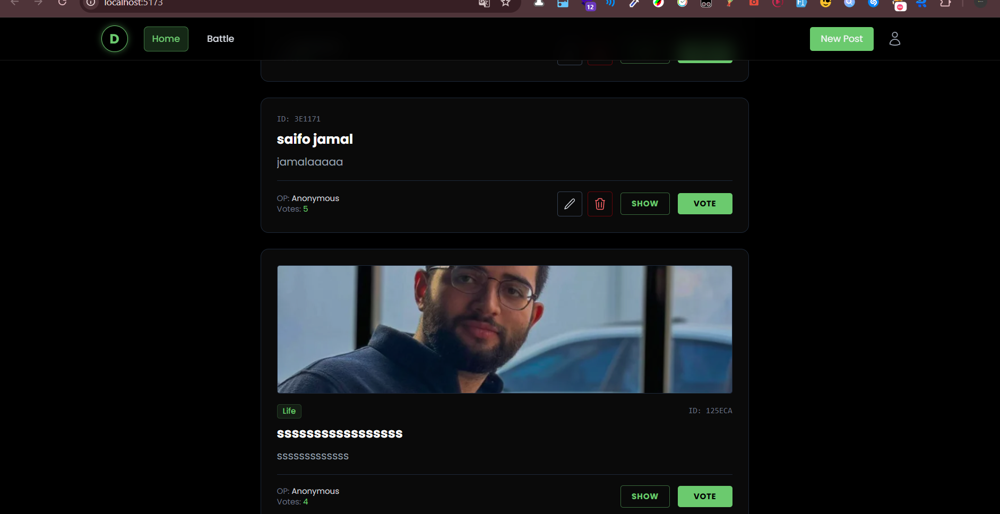

# MERN Blog Application

A full-stack blog application with user authentication, post creation, and image uploads.

## 🚀 Features

- **User Authentication**: Secure Login and Registration with JWT.
- **Post Management**: Create, Read, Update, and Delete (CRUD) blog posts.
- **Image Uploads**: Integration with Cloudinary for seamless image management.
- **Responsive UI**: Built with React and Tailwind CSS for a modern, hacker-themed terminal look.
- **State Management**: Uses Redux Toolkit (RTK) for efficient frontend state handling.

## 🛠️ Technology Stack

### Backend
- **Node.js & Express**: Fast and minimalist web framework.
- **MongoDB & Mongoose**: NoSQL database for flexible data storage.
- **JWT (JSON Web Token)**: For secure authentication.
- **Cloudinary**: For cloud-based image hosting.
- **Multer**: For handling file uploads.

### Frontend
- **React**: Modern component-based UI library.
- **Redux Toolkit**: Simplified state management.
- **Vite**: Performance-optimized build tool.
- **Tailwind CSS**: Utility-first CSS framework.
- **React Router**: For client-side routing.

## 📋 Prerequisites

- [Node.js](https://nodejs.org/) (v18+)
- [MongoDB](https://www.mongodb.com/try/download/community) (Local or Compass/Atlas)
- [Cloudinary Account](https://cloudinary.com/) (For image uploads)

## ⚙️ Setup and Installation

1. **Clone the repository**:
   ```bash
   git clone <repository-url>
   cd blog
   ```

2. **Backend Configuration**:
   - Navigate to the `backend` directory.
   - Install dependencies: `npm install`
   - Create a `.env` file and add the following:
     ```env
     PORT=5000
     MONGO_URI=your_mongodb_connection_uri
     JWT_SECRET=your_jwt_secret
     CLOUDINARY_CLOUD_NAME=your_cloud_name
     CLOUDINARY_API_KEY=your_api_key
     CLOUDINARY_API_SECRET=your_api_secret
     ```

3. **Frontend Configuration**:
   - Navigate to the `frontend` directory.
   - Install dependencies: `npm install`
   - (Optional) Configure environment variables if needed.

## 🏃 How to Run

### Start the Backend
```bash
cd backend
npm run dev
```
The server will start on `http://localhost:5000`.

### Start the Frontend
```bash
cd frontend
npm run dev
```
The application will be available at `http://localhost:5173`.

## 📂 Project Structure

- `backend/`: Node.js/Express API, MongoDB models, and Cloudinary config.
- `frontend/`: React/Vite application with Redux state management.
