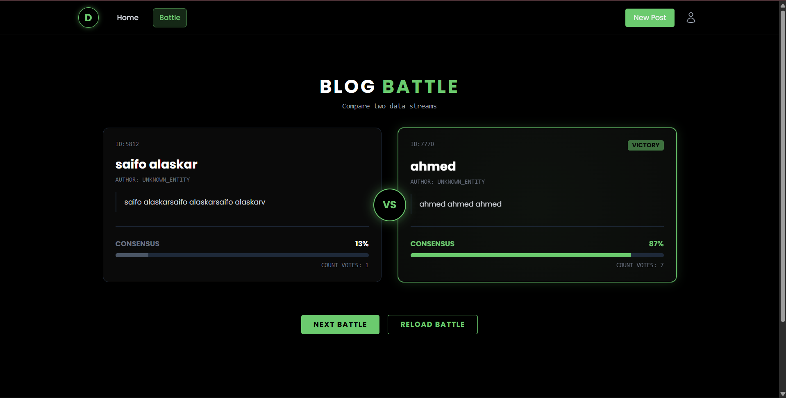
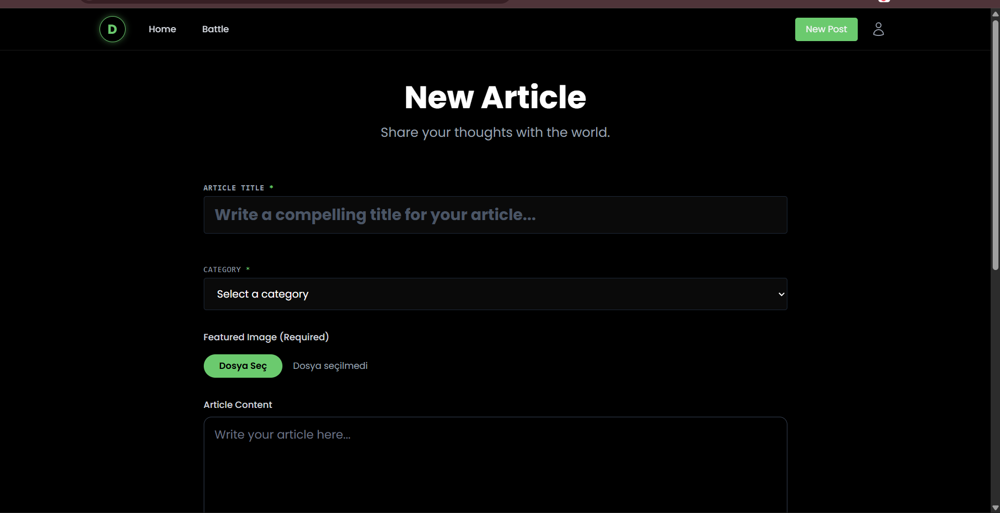
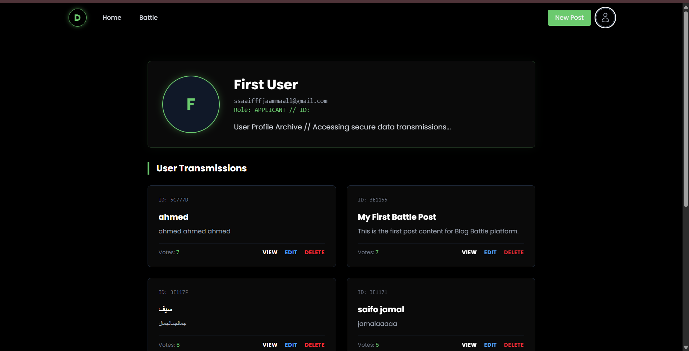
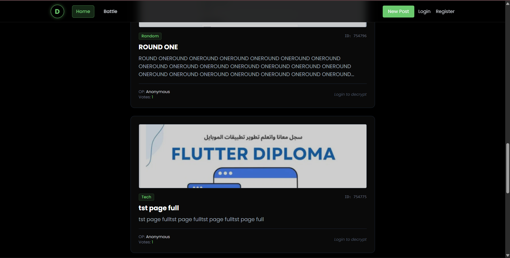
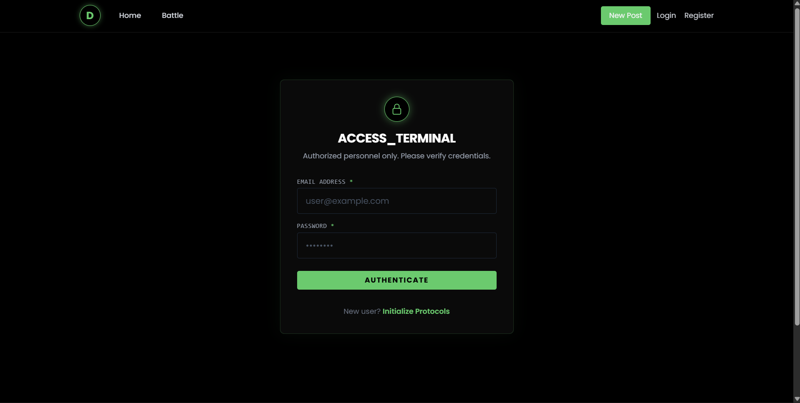

# 🧠 MERN Blog Battle Application

A full-stack **MERN blog platform** where users can create posts, upload images, and **battle by voting**.  
The project focuses on clean architecture, performance, and a modern hacker-style UI.

---

## ✨ Features

### 🔐 Authentication
- User Register & Login
- JWT-based authentication
- Secure protected routes

### 📝 Blog Posts (CRUD)
- Create posts with title, content, and category
- Optional image upload using Cloudinary
- Edit & delete your own posts only
- View all posts sorted by votes and date

### ⚔️ Battle & Voting
- Vote on posts (one vote per user)
- Battle view for competitive comparison
- Vote locking to prevent duplicates

### 🎨 UI & UX
- Hacker / terminal-style dark theme
- Responsive layout (mobile & desktop)
- Icon-based actions (edit / delete / profile)
- Optimized loading states

---

## 🖼️ Screenshots








---

## 🛠️ Technology Stack

### Backend
- Node.js
- Express.js
- MongoDB & Mongoose
- JWT Authentication
- Multer
- Cloudinary

### Frontend
- React
- Redux Toolkit
- Vite
- Tailwind CSS
- React Router
- Axios

---

## 📋 Prerequisites
- Node.js v18+
- MongoDB
- Cloudinary Account

---

## ⚙️ Installation & Setup

### Clone Repository
```bash
git clone https://github.com/your-username/blog-battle.git
cd blog-battle
```

### Backend
```bash
cd backend
npm install
```

Create `.env`:
```env
PORT=5000
MONGO_URI=your_mongodb_connection_uri
JWT_SECRET=your_jwt_secret

CLOUDINARY_CLOUD_NAME=your_cloud_name
CLOUDINARY_API_KEY=your_api_key
CLOUDINARY_API_SECRET=your_api_secret
```

### Frontend
```bash
cd frontend
npm install
```

.env (optional)
```env
VITE_API_URL=http://localhost:5000/api
```

---

## ▶️ Run Project

Backend:
```bash
npm run dev
```

Frontend:
```bash
npm run dev
```

---

## 📂 Project Structure
```bash
blog-battle/
├── backend/
├── frontend/
└── README.md
```

---

## 🤝 Contributing
Fork → Branch → Commit → PR
